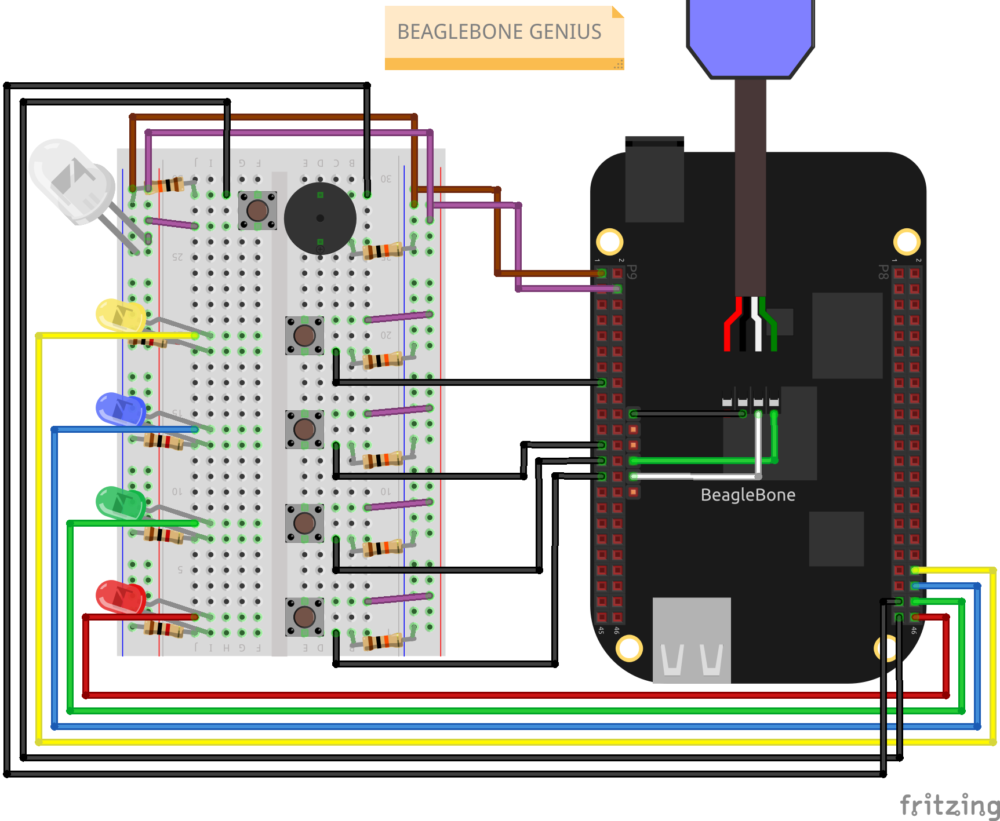

# Projeto Genius - BeagleBone Black

Este projeto implementa o jogo Genius na plataforma BeagleBone Black. O Genius é um jogo eletrônico de memória que desafia os jogadores a repetirem sequências de cores e sons em uma matriz de botões.

## Funcionamento do Jogo

O jogo Genius consiste em uma matriz de botões coloridos e um painel de luzes correspondentes. O objetivo do jogo é memorizar e repetir sequências de cores e sons que são reproduzidas aleatoriamente pelo sistema. Cada jogador deve repetir corretamente a sequência apresentada para avançar para a próxima rodada.

O jogo é controlado pela BeagleBone Black, uma placa de desenvolvimento embarcado baseada no processador ARM. A BeagleBone Black executa o código implementado em linguagem C e é responsável pela geração dos sinais de áudio, controle dos botões e acendimento das luzes.

## Estrutura do Projeto

O projeto está organizado da seguinte forma:

genius/
├── bin/             # Arquivos binários (.boot)
├── inc/             # Arquivos de cabeçalho (.h)
├── obj/             # Objetos compilados (.o)
└── src/             # Arquivos de código fonte (.c)
resources/           # Recursos do projeto
│   └── base.png     # Foto da base da arquitetura do projeto
Makefile             # Arquivo de compilação e execução
README.md            # Documentação do projeto (você está aqui)

## Autores

- [Ryan Guilherme](https://github.com/ryanguilherme)
- [Guilherme Araújo](https://github.com/guiaf04)
- [Éliton Melo](https://github.com/elitonnmelo)

## Disciplina e Instituição

Este projeto foi desenvolvido como o projeto final da disciplina TPSE I (Técnicas de Programação para Sistemas Embarcados I), ministrada pelo professor Francisco Helder, na Universidade Federal do Ceará (UFC), Campus Quixadá.

## Compilação e Execução

O projeto é gerenciado por um `Makefile`. Para compilar e executar o jogo Genius, siga as etapas abaixo:

1. Certifique-se de ter as dependências de desenvolvimento instaladas no seu sistema e na BeagleBone Black.
2. Clone este repositório em seu dispositivo.
3. Acesse o diretório do projeto: `cd genius`.
4. Execute o comando `make` para compilar o projeto.
6. Com o tftp devidamente configurado para o diretório /tftpboot/, o binário (appGenius.bin) será armazenado nele.
7. No endereço de memória desejado da BeagleBone Black, acesse o arquivo binário e a aplicação iniciará.

## Contribuições

Contribuições são bem-vindas! Se você encontrar problemas, bugs ou tiver sugestões de melhorias, fique à vontade para abrir uma issue ou enviar um pull request neste repositório.

## Licença

Este projeto está licenciado sob a [MIT License](LICENSE).
